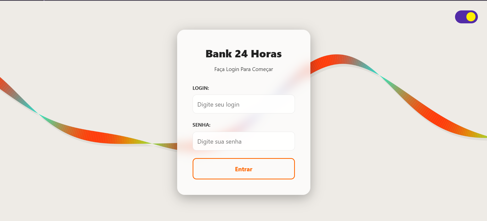
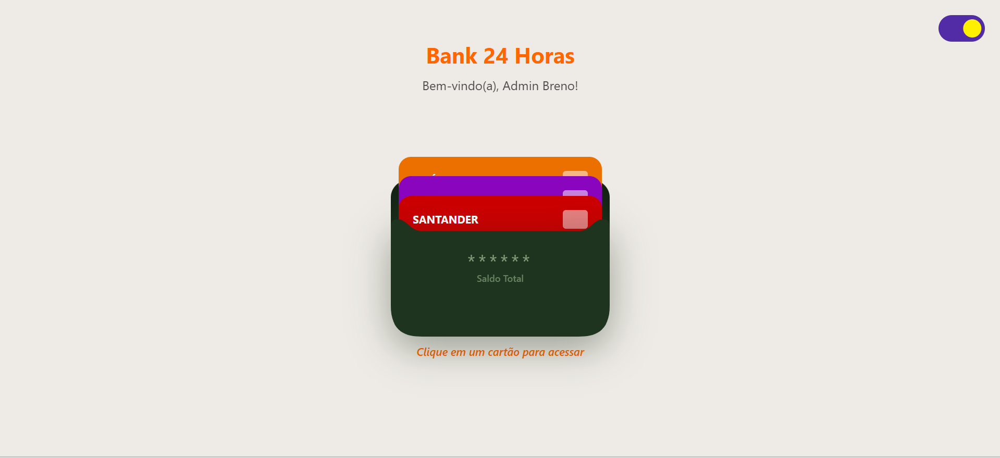
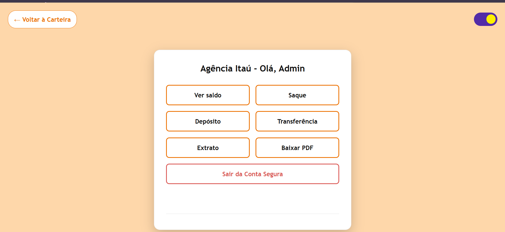
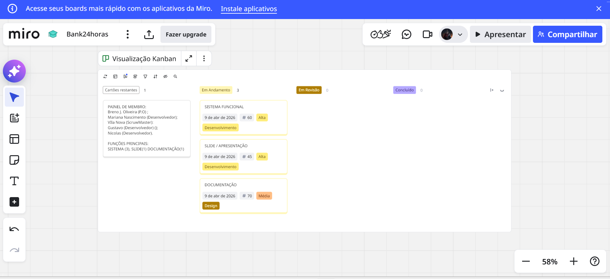
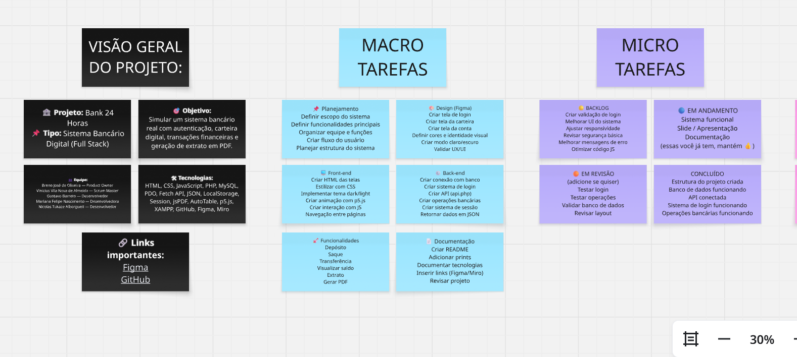
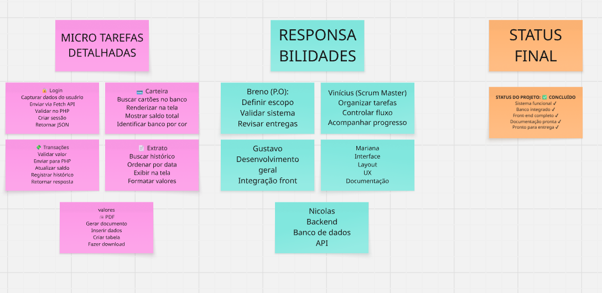
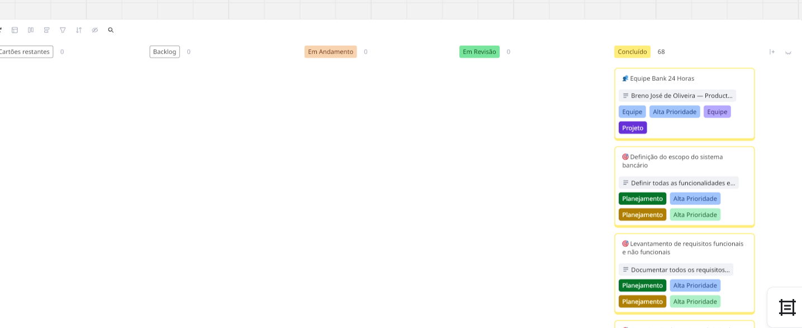
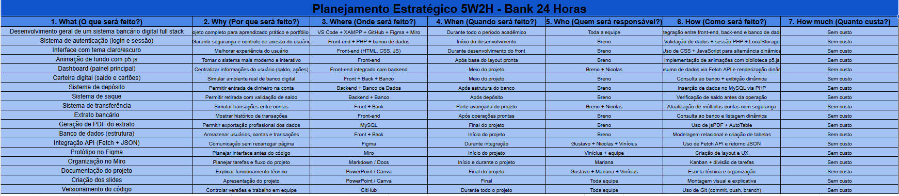

# 🏦 Bank 24 Horas - Sistema Bancário Digital

<p align="center">
  
  
  
</p>

<p align="center">
  <!-- Front-end -->
  
  
  
  
</p>

<p align="center">
  <!-- Back-end -->
  
  
  
</p>

<p align="center">
  <!-- Banco -->
  
</p>

<p align="center">
  <!-- APIs e recursos -->
  
  
  
</p>

<p align="center">
  <!-- PDF -->
  
</p>

<p align="center">
  <!-- Ferramentas -->
  
  
  
  
</p>

<p align="center">
  <!-- Versionamento -->
  
  
</p>

---

## 📑 Índice

1. [Sobre o Projeto](#-sobre-o-projeto)
2. [Funcionalidades](#-funcionalidades)
3. [Tecnologias Utilizadas](#-tecnologias-utilizadas)
4. [Galeria do Sistema](#-galeria-do-sistema)
5. [Protótipo no Figma](#-protótipo-no-figma)
6. [Organização no Miro](#-organização-no-miro)
7. [Equipe do Projeto](#-equipe-do-projeto)
8. [Requisitos de Instalação](#-requisitos-de-instalação)
9. [Configuração do Banco de Dados](#-configuração-do-banco-de-dados)
10. [Como Executar o Projeto](#-como-executar-o-projeto)
11. [Fluxo do Sistema](#-fluxo-do-sistema)
12. [Observações Importantes](#-observações-importantes)
13. [Contatos e Redes Sociais](#-contatos-e-redes-sociais)
14. [Conclusão Final](#-conclusão-final)
15. [Licença](#-licença)

---

## 🎯 Sobre o Projeto

O **Bank 24 Horas** é um sistema bancário digital _full stack_ completo, concebido como um projeto acadêmico e de portfólio. Desenvolvido com foco na experiência do usuário e na segurança dos dados, o sistema simula o ambiente real de um internet banking moderno. 

O projeto apresenta uma interface rica e responsiva, oferecendo desde a autenticação segura do usuário até a execução de transações financeiras (depósitos, saques e transferências) e a geração de relatórios formais em PDF. Toda a persistência de dados é gerenciada de forma robusta utilizando PHP e MySQL, operando sob a segurança da biblioteca PDO.

---

## ⚙️ Funcionalidades

O sistema conta com um escopo amplo de operações essenciais para o gerenciamento de contas virtuais:

* 🔐 **Autenticação Segura:** Tela de login validada e sistema de persistência de sessão.
* 🌓 **Personalização de Interface:** Alternância fluida entre o Tema Claro e Escuro.
* ✨ **Imersão Visual:** Animações interativas de fundo implementadas com *p5.js*.
* 💳 **Carteira Digital:** Visualização gráfica de cartões e gerenciamento de saldo em tempo real.
* 🏦 **Operações Bancárias:**
    * Depósitos diretos na conta.
    * Saques com validação de saldo disponível.
    * Transferências entre contas e bancos.
* 📄 **Extrato Dinâmico:** Organização cronológica do histórico completo de operações financeiras.
* 🖨️ **Geração de Relatórios:** Exportação do extrato bancário em formato PDF utilizando *jsPDF* e *jsPDF-AutoTable*.
* 🔄 **Integração Backend:** Carregamento de dados assíncrono e dinâmico diretamente do banco de dados (Fetch API + JSON).

---

## 🛠 Tecnologias Utilizadas

O desenvolvimento foi conduzido utilizando um stack moderno e consolidado, dividido entre Front-end, Back-end e Ferramentas de Design/Gestão:

### Front-end
<p align="left">
  
  
  
  
</p>

### Back-end & Banco de Dados
<p align="left">
  
  
  
</p>

### Bibliotecas e API
* **jsPDF & jsPDF-AutoTable:** Para renderização de relatórios em PDF.
* **Fetch API, JSON, LocalStorage & Session:** Para comunicação assíncrona e gerenciamento de estado no lado do cliente.

### Ferramentas & Organização
<p align="left">
  
  
  
  
  
  
</p>

---

## 🖼 Galeria do Sistema

Abaixo estão algumas capturas que ilustram a interface moderna e as funcionalidades do Bank 24 Horas:

<p align="center">
  
  <br>
  <em><strong>Figura 1:</strong> Tela de login com design moderno, validação de dados e animações de fundo interativas.</em>
</p>

<p align="center">
  
  <br>
  <em><strong>Figura 2:</strong> Dashboard principal exibindo a carteira com cartões, saldo e acesso rápido às operações financeiras.</em>
</p>

<p align="center">
  
  <br>
  <em><strong>Figura 3:</strong> Visualização do extrato bancário detalhado com opção para exportação em documento PDF.</em>
</p>

---

## 🎨 Protótipo no Figma

A concepção visual e a experiência do usuário (UX/UI) foram planejadas meticulosamente antes da escrita do código. O protótipo de alta fidelidade ajudou a guiar o desenvolvimento do tema claro/escuro e das interações.

<p align="center">
  <a href="https://www.figma.com/design/xIQnuxb1GBhh3lXgtJvzbU/Sem-t%C3%ADtulo--c%C3%B3pia-?node-id=0-1&t=abpQvrik1MWTwUCq-1" target="_blank">
    
  </a>
</p>

---

## 📊 Organização no Miro

A organização do projeto foi estruturada no **Miro** para permitir o acompanhamento das macro e micro tarefas, a distribuição das atividades entre a equipe e a visualização do progresso geral do desenvolvimento. O board foi utilizado para registrar o planejamento do sistema, os cartões em andamento e as entregas concluídas, mantendo o fluxo do projeto bem definido e documentado.

<p align="center">
  <a href="https://miro.com/welcomeonboard/NGNhWVRxeWdMOFBEWEZpZG8yZjdXSzlNVDBsM3FJaGpHcmFObXdxV2RiS0NJaWlVUE5rZ25lYWRwalM5a0xWcmpXQzNNOGpGSTJmRFNyenlGaFJXNHZRS1F6QXhyWVl4dnAyOFFaWTZQek5Pd2daMmFuUEpWMjJwdmpvTWZQQUhNakdSWkpBejJWRjJhRnhhb1UwcS9BPT0hdjE=?share_link_id=138496012116" target="_blank">
    
  </a>
</p>

<table>
  <tr>
    <td align="center">
      
    </td>
    <td align="center">
      
    </td>
    <td align="center">
      
    </td>
    <td align="center">
      
    </td>
  </tr>
  <tr>
    <td colspan="4" align="center">
      
    </td>
  </tr>
</table>

---

## 🧾 5W2H

O 5W2H foi utilizado para estruturar a visão estratégica do projeto, definindo claramente os objetivos, responsáveis, metodologia e resultados esperados. Essa abordagem contribuiu para um planejamento mais eficiente e alinhado com as metas do sistema.

<p align="center">
  
</p>

---

## 👥 Equipe do Projeto

Este projeto foi construído por um time dedicado, onde cada membro desempenhou um papel fundamental no ciclo de desenvolvimento:

* **BRENO JOSÉ DE OLIVEIRA — *Product Owner***
    Responsável por definir a visão do produto, priorizar o backlog de funcionalidades e garantir que o projeto atendesse aos requisitos de negócio estabelecidos.
* **GUSTAVO BARRETO — *Desenvolvedor***
    Atuou na implementação de código, integração de sistemas e resolução de desafios técnicos ao longo do desenvolvimento.
* **MARIANA FELIPE NASCIMENTO — *Desenvolvedora***
    Focada na construção de interfaces limpas e funcionais, garantindo a fidelidade do layout desenvolvido e a boa experiência do usuário.
* **NICOLAS TUKAZE ALBORGUETI — *Desenvolvedor***
    Trabalhou ativamente na integração entre o front-end e o back-end, estruturando a lógica de comunicação de dados.
* **VINÍCIUS VILA NOVA DE ALMEIDA — *Scrum Master***
    Liderou as cerimônias ágeis, facilitou a comunicação da equipe e auxiliou na remoção de impedimentos para manter o fluxo contínuo de entregas.

---

## 💻 Requisitos de Instalação

Para executar o Bank 24 Horas localmente, você precisará dos seguintes softwares instalados:
* [Git](https://git-scm.com/) (para clonar o repositório).
* [XAMPP](https://www.apachefriends.org/pt_br/index.html) (ou WAMP/MAMP) para rodar o servidor Apache e o MySQL.
* Navegador Web atualizado (Google Chrome, Firefox, Edge).

---

## 🗄️ Configuração do Banco de Dados

1. Inicie o painel de controle do **XAMPP** e ative os módulos **Apache** e **MySQL**.
2. Acesse o `phpMyAdmin` pelo navegador (geralmente em `http://localhost/phpmyadmin`).
3. Crie um novo banco de dados (ex: `bank24horas_db`).
4. Importe o arquivo SQL (fornecido na pasta do projeto) para criar as tabelas necessárias de usuários, contas e transações.
5. Verifique o arquivo de conexão PDO dentro da pasta do backend (ex: `conexao.php`) e ajuste as credenciais (usuário e senha do banco) caso necessário.

---

## 🚀 Como Executar o Projeto

1. Abra o terminal e clone o repositório dentro da pasta raiz do seu servidor local (no XAMPP, a pasta `htdocs`):
   ```bash
   git clone [https://github.com/Breno-J-Oliveira/NOME_DO_REPOSITORIO.git](https://github.com/Breno-J-Oliveira/NOME_DO_REPOSITORIO.git)

2. Acesse a pasta do projeto clonado.

3. No seu navegador, digite:

   http://localhost/NOME_DO_REPOSITORIO/index.html

4. Utilize as credenciais cadastradas no banco de dados para realizar o login e testar a plataforma.

## 🛤️ Fluxo do Sistema (Técnico)

1. **Acesso e Segurança:** O usuário acessa o `index.html`. Os dados inseridos no formulário são enviados via Fetch API para o backend PHP. O PHP valida a senha via hash e retorna um JSON. Caso seja válido, uma Sessão (PHP/LocalStorage) é iniciada.
2. **Dashboard:** Redirecionado ao `index2.html`, o JavaScript consome os endpoints PHP para carregar os dados reais do banco (saldo, nome, cartões). A animação do `p5.js` roda no background de forma otimizada.
3. **Transações:** Quando o usuário realiza um depósito ou transferência, um payload JSON é enviado ao backend. O PHP utiliza PDO para inserir a transação no MySQL e atualizar o saldo da conta, garantindo atomicidade na operação. O frontend recebe a resposta de sucesso e atualiza o DOM instantaneamente.
4. **Extrato e PDF:** No `index3.html`, o histórico é puxado. A conversão da tabela em PDF é feita via client-side utilizando a biblioteca `jsPDF-AutoTable`, poupando processamento do servidor.

---

## ⚠️ Observações Importantes

* Este é um projeto com foco educacional e de portfólio. Não insira dados sensíveis ou informações financeiras reais.
* A alternância entre Tema Claro e Escuro é salva no `LocalStorage` do navegador, mantendo a preferência do usuário entre os acessos.
* Certifique-se de que a extensão PDO esteja habilitada nas configurações do seu PHP (`php.ini`).

---

## 🤝 Contatos e Redes Sociais

Gostou do projeto? Conecte-se comigo através das minhas redes para conversarmos sobre tecnologia, desenvolvimento ou oportunidades:

<p align="center">
  <a href="https://github.com/Breno-J-Oliveira" target="_blank">
    
  </a>
  <a href="https://www.linkedin.com/in/breno-j-oliveira-672619352/" target="_blank">
    
  </a>
  <a href="https://www.instagram.com/brenot300" target="_blank">
    
  </a>
  <a href="https://x.com/BrenoJOliveira_" target="_blank">
    
  </a>
</p>

---

## 🏆 Conclusão Final

O desenvolvimento do **Bank 24 Horas** foi um divisor de águas técnico para nossa equipe. Ele exigiu a superação de desafios complexos, como a manipulação segura de estado e sessão entre o Front-end e o Back-end, integração de bibliotecas visuais pesadas, além da coordenação e trabalho em equipe estruturado. O resultado é um produto sólido, profissional e que cumpre todos os requisitos de um sistema corporativo de entrada.
